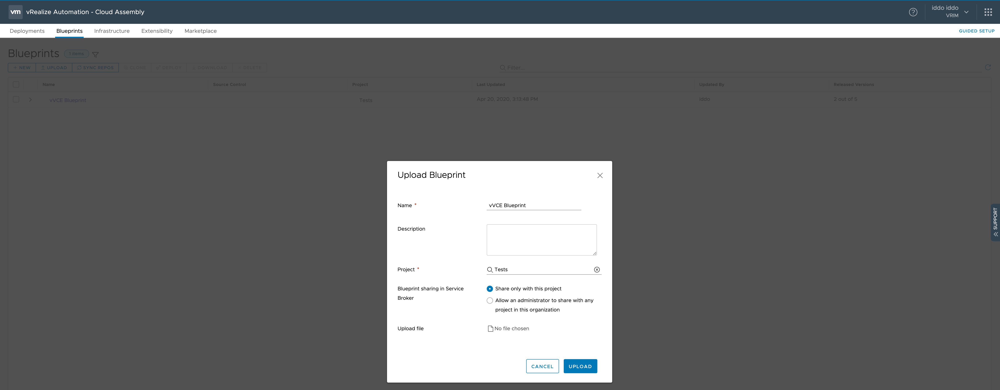

# Introduction

Blueprints represent the most important entity within vRealize Automation – they define how to provision and manage the lifecycle of resources in vRealize Automation (aka, infrastrucutre as a code).
In this section, we will go deeper on the different sections of the blueprint and why we configure those for the VCE.

# Useage

By going to Cloud Assembly->Blueprints->Upload, you should be able to upload the ``template.yaml`` with the given name and towards project you defined previously. In my case, I called it "vVCE Blueprint" and upload it to project called "Tests".  

  

# Overview of the Blueprint

After uploading and opening the blueprint you will see that vRA has constructed a topology based on the definition of the YAML and the sections in between it. 

## Inputs

## Resources
### Compute
### Network

# Resources to keep in mind:
- [vRA8 Resource Schema](https://code.vmware.com/apis/894/vrealize-automation-resource-type-schema)
- [What are some blueprint code examples](https://docs.vmware.com/en/vRealize-Automation/8.0/Using-and-Managing-Cloud-Assembly/GUID-4717026E-D11A-48FE-93A9-E409A623C723.html)
 
