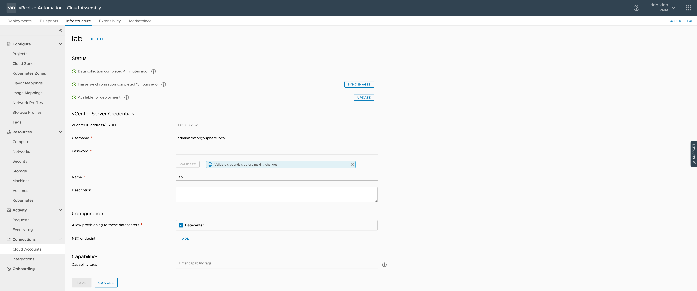
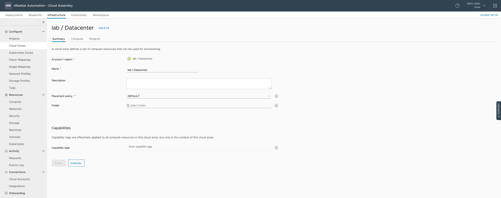
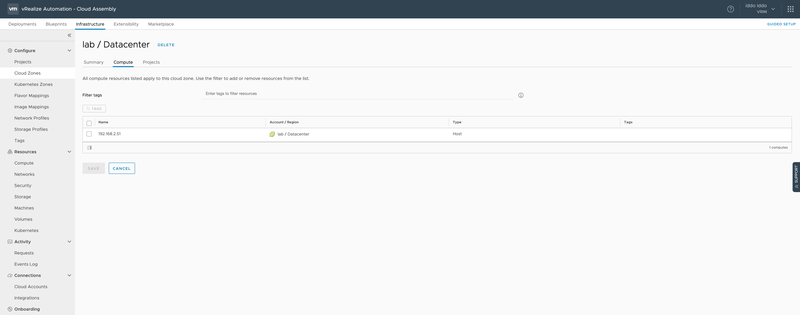
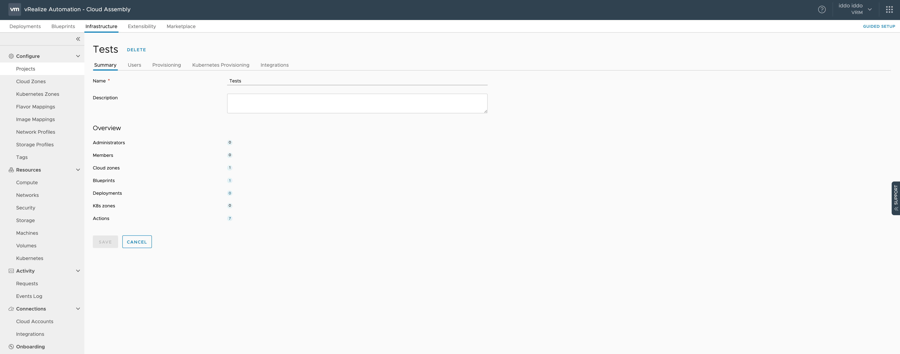
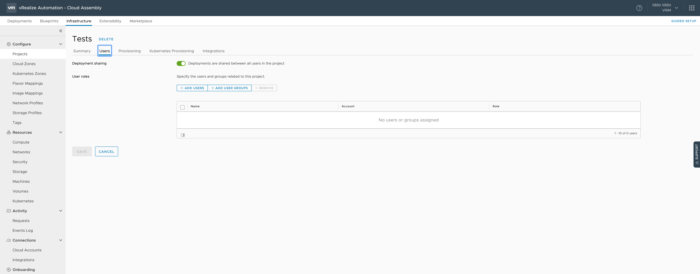
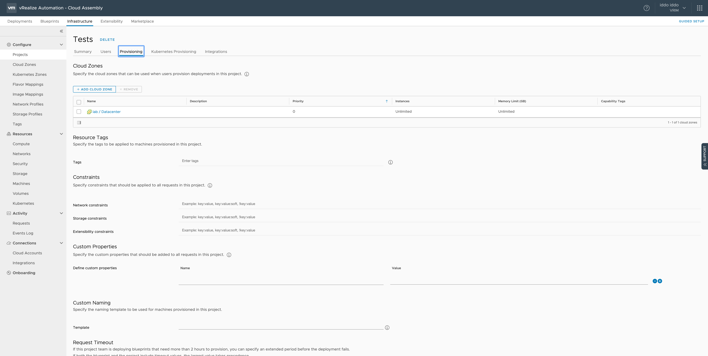
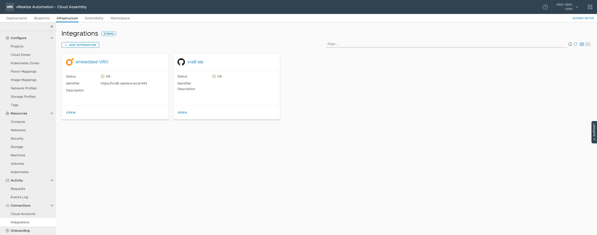

# Introduction

This section will be covering screenshots around infrastructure environment used in "Cloud Assembly". 

For a greenfield configuration, the following order of steps should be followed:
1) "Cloud Accounts" - Configure connection between vRA8 and existing ESXi, AWS or Azure deployment. In this example only ESXi based host is used. 
2) "Cloud Zones" - Associate the "Cloud Accounts" to "Cloud Zones". In this example the vCenter configuration will be associated to one "Cloud Zone".
3) "Project" - Associating the "Cloud Zone" to that Project. In this example, one "Cloud Zone" is configured in one "Project"
4) "Integrations" - Connect to third party tools like vRealize Orchestartor, Github, IPAM manager, etc. to get more power into vRA8. In this example only the default "embedded-VRO" and additional GitHub repository for backup is used. 

The aim of this section is to have a "sanity check" around the configuration done. The sections aim is not to go into the detail how-to or why for that please refer to our public documentation. 

## Cloud Accounts

In this example, only one cloud account was created called "lab" of type vCenter. At "New Cloud Account" creation and with "vCenter IP address/FQDN",  "Username", "Password" and "Name", vRA8 will attempt to connect to that vCenter and pull all necessary information, showing above.

**Important**: The ESXi configuration must have the compute in a "Cluster". If this not the case, then it will fail with an error. Also if one has one ESXi, configuring "Cluster" in ESXi is just a logical configuration and does not force to one to have many ESXi hosts. In the example, "Datacenter" is the cluster name above. 
 
## Cloud Zones

### Summary

### Compute

## Project

### Summary

Associated to this project one can see the 7 "Actions" associated to it, the 1 "Blueprint" and the 1 "Cloud Zone". If copying the exact project configuration, you should have those numbers as a sanity check. 

### Users

No special configuration done other then switching on "Deployments are shared between all users in the project". This lets different users to use all deployments and such useful. 

### Provisioning 

Under "Cloud Zones", I added my "lab / Datacenter" environment, so vRA8 knows which environment to use for provisioning. No "Constraints" have been defined here.

One could consider to set "Request Timeout" to ensure that "Actions" will fail after given time but that is optional. 

## Integration

Using the default vRO integration and added also an GitHub support as well. The "Blueprint" and "Actions" will be saved there as backup.
